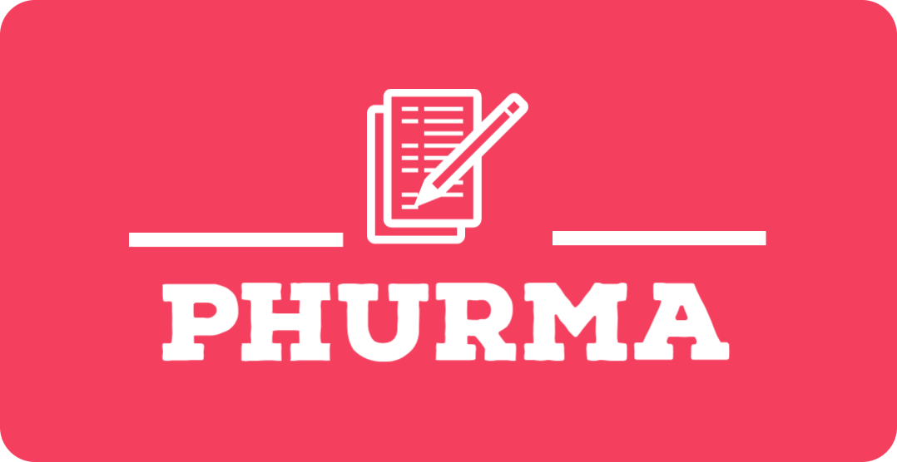
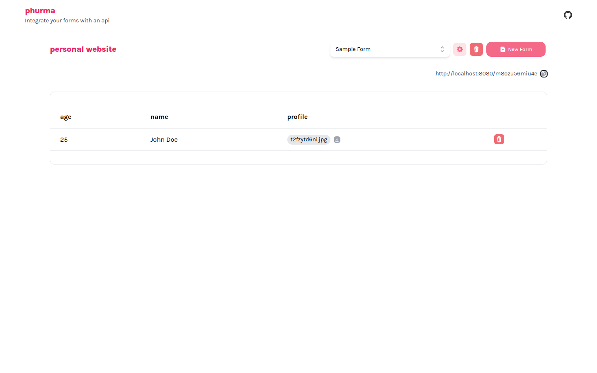

<div align="center">


<h1>phurma</h1>

<p>Self-manage and integrate your forms through api.</p>

<p>Application is built for Deta Space.</p>

</div>

App is still in **very early-stages of development** so expect to have many bugs and stuff not working as expected.

**App Screenshot**


## Project Structure

- `phurma`

  Fullstack Next.js application with it's internal api server.

- `f`

  Gofiber application to handle form responses. We do not want to have our form urls to have `/api` in its path so we use a different micro to handle the form requests which is in `/f` url path.

### Development

Use the space cli to work to run the development instance.

```sh
space dev
```

## To Be Implemented

- Form Integrations
  - Webhooks
    - ~~Discord~~
  - Email (if possible)
  - etc...
- Export responses
  - ~~To CSV~~
- Custom form urls (ex: `/f/my-form`)
- Other ways to view responses
- Other options on saving files (GoogleDrive, OneDrive, etc...)
- etc..., feature requests are welcome

## Contributing

Contributions are very much welcome.

Before commiting changes, please respect the editor preferences specially prettier.
